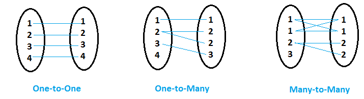

```python
{
    "tags": [
        "hide-input",
    ]
}

# CHANGE INFO TO RUN ON YOUR LOCAL
host = "127.0.0.1"
port = "5432"
database = "MSDS691"
# database = 'msds691'
user = "postgres"

```


```python
import psycopg2
import pandas as pd
import numpy as np
from IPython.display import Image
from IPython.core.display import HTML

conn = psycopg2.connect(host=host, port=port, database=database, user=user)
cur = conn.cursor()

```


```python
def select_query(query):
    df = pd.read_sql_query(query, conn, coerce_float=False)
    df.replace([None], np.nan, inplace=True)

    return df

```


```python
from IPython.core.display import display, HTML


def display_side_by_side(dfs: list, captions: list):
    """Display tables side by side to save vertical space
    Input:
        dfs: list of pandas.DataFrame
        captions: list of table captions
    """

    output = ""
    combined = dict(zip(captions, dfs))
    for caption, df in combined.items():
        output += df.style.set_table_attributes("style='display:inline'")\
                    .set_caption(caption)._repr_html_()
        output += "\xa0\xa0\xa0"
    display(HTML(output))

```


```python
cur.execute(f'''DROP TABLE IF EXISTS names;''')
cur.execute(f'''DROP TABLE IF EXISTS transactions;''')

```


```python
create = f'''

DROP TABLE IF EXISTS names;

CREATE TABLE names
(id INTEGER,
name VARCHAR,
PRIMARY KEY (id))
;

INSERT INTO names
VALUES
(1, 'Jon Smith'),
(2, 'Sarah Adams'),
(3, 'Maria Lopez')
;'''

cur.execute(create)
conn.commit()

create = f'''

DROP TABLE IF EXISTS transactions;

CREATE TABLE transactions
(id INTEGER,
 amount NUMERIC,
 PRIMARY KEY (id))
;

INSERT INTO transactions
VALUES
(1, 10),
(3, 20),
(7, 50)
;'''

cur.execute(create)
conn.commit()

```


```python
query = f'''

SELECT *
FROM names

;'''
df_names = select_query(query)
df_names

```


<div>
<style scoped>
    .dataframe tbody tr th:only-of-type {
        vertical-align: middle;
    }

    .dataframe tbody tr th {
        vertical-align: top;
    }

    .dataframe thead th {
        text-align: right;
    }
</style>
<table border="1" class="dataframe">
  <thead>
    <tr style="text-align: right;">
      <th></th>
      <th>id</th>
      <th>name</th>
    </tr>
  </thead>
  <tbody>
    <tr>
      <th>0</th>
      <td>1</td>
      <td>Jon Smith</td>
    </tr>
    <tr>
      <th>1</th>
      <td>2</td>
      <td>Sarah Adams</td>
    </tr>
    <tr>
      <th>2</th>
      <td>3</td>
      <td>Maria Lopez</td>
    </tr>
  </tbody>
</table>
</div>


```python
query = f'''

SELECT *
FROM transactions

;'''
df_transactions = select_query(query)
df_transactions

```


<div>
<style scoped>
    .dataframe tbody tr th:only-of-type {
        vertical-align: middle;
    }

    .dataframe tbody tr th {
        vertical-align: top;
    }

    .dataframe thead th {
        text-align: right;
    }
</style>
<table border="1" class="dataframe">
  <thead>
    <tr style="text-align: right;">
      <th></th>
      <th>id</th>
      <th>amount</th>
    </tr>
  </thead>
  <tbody>
    <tr>
      <th>0</th>
      <td>1</td>
      <td>10</td>
    </tr>
    <tr>
      <th>1</th>
      <td>3</td>
      <td>20</td>
    </tr>
    <tr>
      <th>2</th>
      <td>7</td>
      <td>50</td>
    </tr>
  </tbody>
</table>
</div>


### General Syntax

SELECT <field> <br>
FROM TableA A <br>
[Join Type] JOIN <br>
TableB B <br>
ON A.key=B.key <br>

### Inner Join


```python
query = f'''

SELECT  
names.id, 
names.name, 
transactions.amount
FROM names 
    INNER JOIN transactions
        ON (names.id = transactions.id)

;'''
df_inner_join = select_query(query)
display_side_by_side([df_names, df_transactions, df_inner_join],
                     ['Left Table', 'Right Table', 'Inner Join Output'])

```


<style  type="text/css" >
</style><table id="T_bb86d1b6_258b_11ec_ad4d_1e00311af459" style='display:inline'><caption>Left Table</caption><thead>    <tr>        <th class="blank level0" ></th>        <th class="col_heading level0 col0" >id</th>        <th class="col_heading level0 col1" >name</th>    </tr></thead><tbody>
                <tr>
                        <th id="T_bb86d1b6_258b_11ec_ad4d_1e00311af459level0_row0" class="row_heading level0 row0" >0</th>
                        <td id="T_bb86d1b6_258b_11ec_ad4d_1e00311af459row0_col0" class="data row0 col0" >1</td>
                        <td id="T_bb86d1b6_258b_11ec_ad4d_1e00311af459row0_col1" class="data row0 col1" >Jon Smith</td>
            </tr>
            <tr>
                        <th id="T_bb86d1b6_258b_11ec_ad4d_1e00311af459level0_row1" class="row_heading level0 row1" >1</th>
                        <td id="T_bb86d1b6_258b_11ec_ad4d_1e00311af459row1_col0" class="data row1 col0" >2</td>
                        <td id="T_bb86d1b6_258b_11ec_ad4d_1e00311af459row1_col1" class="data row1 col1" >Sarah Adams</td>
            </tr>
            <tr>
                        <th id="T_bb86d1b6_258b_11ec_ad4d_1e00311af459level0_row2" class="row_heading level0 row2" >2</th>
                        <td id="T_bb86d1b6_258b_11ec_ad4d_1e00311af459row2_col0" class="data row2 col0" >3</td>
                        <td id="T_bb86d1b6_258b_11ec_ad4d_1e00311af459row2_col1" class="data row2 col1" >Maria Lopez</td>
            </tr>
    </tbody></table>   <style  type="text/css" >
</style><table id="T_bb86e714_258b_11ec_ad4d_1e00311af459" style='display:inline'><caption>Right Table</caption><thead>    <tr>        <th class="blank level0" ></th>        <th class="col_heading level0 col0" >id</th>        <th class="col_heading level0 col1" >amount</th>    </tr></thead><tbody>
                <tr>
                        <th id="T_bb86e714_258b_11ec_ad4d_1e00311af459level0_row0" class="row_heading level0 row0" >0</th>
                        <td id="T_bb86e714_258b_11ec_ad4d_1e00311af459row0_col0" class="data row0 col0" >1</td>
                        <td id="T_bb86e714_258b_11ec_ad4d_1e00311af459row0_col1" class="data row0 col1" >10</td>
            </tr>
            <tr>
                        <th id="T_bb86e714_258b_11ec_ad4d_1e00311af459level0_row1" class="row_heading level0 row1" >1</th>
                        <td id="T_bb86e714_258b_11ec_ad4d_1e00311af459row1_col0" class="data row1 col0" >3</td>
                        <td id="T_bb86e714_258b_11ec_ad4d_1e00311af459row1_col1" class="data row1 col1" >20</td>
            </tr>
            <tr>
                        <th id="T_bb86e714_258b_11ec_ad4d_1e00311af459level0_row2" class="row_heading level0 row2" >2</th>
                        <td id="T_bb86e714_258b_11ec_ad4d_1e00311af459row2_col0" class="data row2 col0" >7</td>
                        <td id="T_bb86e714_258b_11ec_ad4d_1e00311af459row2_col1" class="data row2 col1" >50</td>
            </tr>
    </tbody></table>   <style  type="text/css" >
</style><table id="T_bb86f57e_258b_11ec_ad4d_1e00311af459" style='display:inline'><caption>Inner Join Output</caption><thead>    <tr>        <th class="blank level0" ></th>        <th class="col_heading level0 col0" >id</th>        <th class="col_heading level0 col1" >name</th>        <th class="col_heading level0 col2" >amount</th>    </tr></thead><tbody>
                <tr>
                        <th id="T_bb86f57e_258b_11ec_ad4d_1e00311af459level0_row0" class="row_heading level0 row0" >0</th>
                        <td id="T_bb86f57e_258b_11ec_ad4d_1e00311af459row0_col0" class="data row0 col0" >1</td>
                        <td id="T_bb86f57e_258b_11ec_ad4d_1e00311af459row0_col1" class="data row0 col1" >Jon Smith</td>
                        <td id="T_bb86f57e_258b_11ec_ad4d_1e00311af459row0_col2" class="data row0 col2" >10</td>
            </tr>
            <tr>
                        <th id="T_bb86f57e_258b_11ec_ad4d_1e00311af459level0_row1" class="row_heading level0 row1" >1</th>
                        <td id="T_bb86f57e_258b_11ec_ad4d_1e00311af459row1_col0" class="data row1 col0" >3</td>
                        <td id="T_bb86f57e_258b_11ec_ad4d_1e00311af459row1_col1" class="data row1 col1" >Maria Lopez</td>
                        <td id="T_bb86f57e_258b_11ec_ad4d_1e00311af459row1_col2" class="data row1 col2" >20</td>
            </tr>
    </tbody></table>   


### Left Join


```python
query = f'''

SELECT  
names.id, 
names.name, 
transactions.amount
FROM names 
    LEFT JOIN transactions
        ON (names.id = transactions.id)

;'''
df_left_join = select_query(query)
display_side_by_side([df_names, df_transactions, df_left_join],
                     ['Left Table', 'Right Table', 'Left Join Output'])

```


<style  type="text/css" >
</style><table id="T_bcb7d38c_258b_11ec_ad4d_1e00311af459" style='display:inline'><caption>Left Table</caption><thead>    <tr>        <th class="blank level0" ></th>        <th class="col_heading level0 col0" >id</th>        <th class="col_heading level0 col1" >name</th>    </tr></thead><tbody>
                <tr>
                        <th id="T_bcb7d38c_258b_11ec_ad4d_1e00311af459level0_row0" class="row_heading level0 row0" >0</th>
                        <td id="T_bcb7d38c_258b_11ec_ad4d_1e00311af459row0_col0" class="data row0 col0" >1</td>
                        <td id="T_bcb7d38c_258b_11ec_ad4d_1e00311af459row0_col1" class="data row0 col1" >Jon Smith</td>
            </tr>
            <tr>
                        <th id="T_bcb7d38c_258b_11ec_ad4d_1e00311af459level0_row1" class="row_heading level0 row1" >1</th>
                        <td id="T_bcb7d38c_258b_11ec_ad4d_1e00311af459row1_col0" class="data row1 col0" >2</td>
                        <td id="T_bcb7d38c_258b_11ec_ad4d_1e00311af459row1_col1" class="data row1 col1" >Sarah Adams</td>
            </tr>
            <tr>
                        <th id="T_bcb7d38c_258b_11ec_ad4d_1e00311af459level0_row2" class="row_heading level0 row2" >2</th>
                        <td id="T_bcb7d38c_258b_11ec_ad4d_1e00311af459row2_col0" class="data row2 col0" >3</td>
                        <td id="T_bcb7d38c_258b_11ec_ad4d_1e00311af459row2_col1" class="data row2 col1" >Maria Lopez</td>
            </tr>
    </tbody></table>   <style  type="text/css" >
</style><table id="T_bcb80d34_258b_11ec_ad4d_1e00311af459" style='display:inline'><caption>Right Table</caption><thead>    <tr>        <th class="blank level0" ></th>        <th class="col_heading level0 col0" >id</th>        <th class="col_heading level0 col1" >amount</th>    </tr></thead><tbody>
                <tr>
                        <th id="T_bcb80d34_258b_11ec_ad4d_1e00311af459level0_row0" class="row_heading level0 row0" >0</th>
                        <td id="T_bcb80d34_258b_11ec_ad4d_1e00311af459row0_col0" class="data row0 col0" >1</td>
                        <td id="T_bcb80d34_258b_11ec_ad4d_1e00311af459row0_col1" class="data row0 col1" >10</td>
            </tr>
            <tr>
                        <th id="T_bcb80d34_258b_11ec_ad4d_1e00311af459level0_row1" class="row_heading level0 row1" >1</th>
                        <td id="T_bcb80d34_258b_11ec_ad4d_1e00311af459row1_col0" class="data row1 col0" >3</td>
                        <td id="T_bcb80d34_258b_11ec_ad4d_1e00311af459row1_col1" class="data row1 col1" >20</td>
            </tr>
            <tr>
                        <th id="T_bcb80d34_258b_11ec_ad4d_1e00311af459level0_row2" class="row_heading level0 row2" >2</th>
                        <td id="T_bcb80d34_258b_11ec_ad4d_1e00311af459row2_col0" class="data row2 col0" >7</td>
                        <td id="T_bcb80d34_258b_11ec_ad4d_1e00311af459row2_col1" class="data row2 col1" >50</td>
            </tr>
    </tbody></table>   <style  type="text/css" >
</style><table id="T_bcb838ea_258b_11ec_ad4d_1e00311af459" style='display:inline'><caption>Left Join Output</caption><thead>    <tr>        <th class="blank level0" ></th>        <th class="col_heading level0 col0" >id</th>        <th class="col_heading level0 col1" >name</th>        <th class="col_heading level0 col2" >amount</th>    </tr></thead><tbody>
                <tr>
                        <th id="T_bcb838ea_258b_11ec_ad4d_1e00311af459level0_row0" class="row_heading level0 row0" >0</th>
                        <td id="T_bcb838ea_258b_11ec_ad4d_1e00311af459row0_col0" class="data row0 col0" >1</td>
                        <td id="T_bcb838ea_258b_11ec_ad4d_1e00311af459row0_col1" class="data row0 col1" >Jon Smith</td>
                        <td id="T_bcb838ea_258b_11ec_ad4d_1e00311af459row0_col2" class="data row0 col2" >10</td>
            </tr>
            <tr>
                        <th id="T_bcb838ea_258b_11ec_ad4d_1e00311af459level0_row1" class="row_heading level0 row1" >1</th>
                        <td id="T_bcb838ea_258b_11ec_ad4d_1e00311af459row1_col0" class="data row1 col0" >2</td>
                        <td id="T_bcb838ea_258b_11ec_ad4d_1e00311af459row1_col1" class="data row1 col1" >Sarah Adams</td>
                        <td id="T_bcb838ea_258b_11ec_ad4d_1e00311af459row1_col2" class="data row1 col2" >nan</td>
            </tr>
            <tr>
                        <th id="T_bcb838ea_258b_11ec_ad4d_1e00311af459level0_row2" class="row_heading level0 row2" >2</th>
                        <td id="T_bcb838ea_258b_11ec_ad4d_1e00311af459row2_col0" class="data row2 col0" >3</td>
                        <td id="T_bcb838ea_258b_11ec_ad4d_1e00311af459row2_col1" class="data row2 col1" >Maria Lopez</td>
                        <td id="T_bcb838ea_258b_11ec_ad4d_1e00311af459row2_col2" class="data row2 col2" >20</td>
            </tr>
    </tbody></table>   


### Right Join


```python
query = f'''

SELECT  
transactions.id, 
names.name, 
transactions.amount
FROM names 
    RIGHT JOIN transactions
        ON (names.id = transactions.id)

;'''
df_right_join = select_query(query)
display_side_by_side([df_names, df_transactions, df_right_join],
                     ['Left Table', 'Right Table', 'Right Join Output'])

```


<style  type="text/css" >
</style><table id="T_bdc42050_258b_11ec_ad4d_1e00311af459" style='display:inline'><caption>Left Table</caption><thead>    <tr>        <th class="blank level0" ></th>        <th class="col_heading level0 col0" >id</th>        <th class="col_heading level0 col1" >name</th>    </tr></thead><tbody>
                <tr>
                        <th id="T_bdc42050_258b_11ec_ad4d_1e00311af459level0_row0" class="row_heading level0 row0" >0</th>
                        <td id="T_bdc42050_258b_11ec_ad4d_1e00311af459row0_col0" class="data row0 col0" >1</td>
                        <td id="T_bdc42050_258b_11ec_ad4d_1e00311af459row0_col1" class="data row0 col1" >Jon Smith</td>
            </tr>
            <tr>
                        <th id="T_bdc42050_258b_11ec_ad4d_1e00311af459level0_row1" class="row_heading level0 row1" >1</th>
                        <td id="T_bdc42050_258b_11ec_ad4d_1e00311af459row1_col0" class="data row1 col0" >2</td>
                        <td id="T_bdc42050_258b_11ec_ad4d_1e00311af459row1_col1" class="data row1 col1" >Sarah Adams</td>
            </tr>
            <tr>
                        <th id="T_bdc42050_258b_11ec_ad4d_1e00311af459level0_row2" class="row_heading level0 row2" >2</th>
                        <td id="T_bdc42050_258b_11ec_ad4d_1e00311af459row2_col0" class="data row2 col0" >3</td>
                        <td id="T_bdc42050_258b_11ec_ad4d_1e00311af459row2_col1" class="data row2 col1" >Maria Lopez</td>
            </tr>
    </tbody></table>   <style  type="text/css" >
</style><table id="T_bdc453ae_258b_11ec_ad4d_1e00311af459" style='display:inline'><caption>Right Table</caption><thead>    <tr>        <th class="blank level0" ></th>        <th class="col_heading level0 col0" >id</th>        <th class="col_heading level0 col1" >amount</th>    </tr></thead><tbody>
                <tr>
                        <th id="T_bdc453ae_258b_11ec_ad4d_1e00311af459level0_row0" class="row_heading level0 row0" >0</th>
                        <td id="T_bdc453ae_258b_11ec_ad4d_1e00311af459row0_col0" class="data row0 col0" >1</td>
                        <td id="T_bdc453ae_258b_11ec_ad4d_1e00311af459row0_col1" class="data row0 col1" >10</td>
            </tr>
            <tr>
                        <th id="T_bdc453ae_258b_11ec_ad4d_1e00311af459level0_row1" class="row_heading level0 row1" >1</th>
                        <td id="T_bdc453ae_258b_11ec_ad4d_1e00311af459row1_col0" class="data row1 col0" >3</td>
                        <td id="T_bdc453ae_258b_11ec_ad4d_1e00311af459row1_col1" class="data row1 col1" >20</td>
            </tr>
            <tr>
                        <th id="T_bdc453ae_258b_11ec_ad4d_1e00311af459level0_row2" class="row_heading level0 row2" >2</th>
                        <td id="T_bdc453ae_258b_11ec_ad4d_1e00311af459row2_col0" class="data row2 col0" >7</td>
                        <td id="T_bdc453ae_258b_11ec_ad4d_1e00311af459row2_col1" class="data row2 col1" >50</td>
            </tr>
    </tbody></table>   <style  type="text/css" >
</style><table id="T_bdc47dd4_258b_11ec_ad4d_1e00311af459" style='display:inline'><caption>Right Join Output</caption><thead>    <tr>        <th class="blank level0" ></th>        <th class="col_heading level0 col0" >id</th>        <th class="col_heading level0 col1" >name</th>        <th class="col_heading level0 col2" >amount</th>    </tr></thead><tbody>
                <tr>
                        <th id="T_bdc47dd4_258b_11ec_ad4d_1e00311af459level0_row0" class="row_heading level0 row0" >0</th>
                        <td id="T_bdc47dd4_258b_11ec_ad4d_1e00311af459row0_col0" class="data row0 col0" >1</td>
                        <td id="T_bdc47dd4_258b_11ec_ad4d_1e00311af459row0_col1" class="data row0 col1" >Jon Smith</td>
                        <td id="T_bdc47dd4_258b_11ec_ad4d_1e00311af459row0_col2" class="data row0 col2" >10</td>
            </tr>
            <tr>
                        <th id="T_bdc47dd4_258b_11ec_ad4d_1e00311af459level0_row1" class="row_heading level0 row1" >1</th>
                        <td id="T_bdc47dd4_258b_11ec_ad4d_1e00311af459row1_col0" class="data row1 col0" >3</td>
                        <td id="T_bdc47dd4_258b_11ec_ad4d_1e00311af459row1_col1" class="data row1 col1" >Maria Lopez</td>
                        <td id="T_bdc47dd4_258b_11ec_ad4d_1e00311af459row1_col2" class="data row1 col2" >20</td>
            </tr>
            <tr>
                        <th id="T_bdc47dd4_258b_11ec_ad4d_1e00311af459level0_row2" class="row_heading level0 row2" >2</th>
                        <td id="T_bdc47dd4_258b_11ec_ad4d_1e00311af459row2_col0" class="data row2 col0" >7</td>
                        <td id="T_bdc47dd4_258b_11ec_ad4d_1e00311af459row2_col1" class="data row2 col1" >nan</td>
                        <td id="T_bdc47dd4_258b_11ec_ad4d_1e00311af459row2_col2" class="data row2 col2" >50</td>
            </tr>
    </tbody></table>   


### Full Join


```python
query = f'''

SELECT 
COALESCE(names.id,transactions.id) as id,
names.name, 
transactions.amount
FROM names 
    FULL JOIN transactions
        ON (names.id = transactions.id)

;'''
df_full_join = select_query(query)
display_side_by_side([df_names, df_transactions, df_full_join],
                     ['Left Table', 'Right Table', 'Full Join Output'])

```


<style  type="text/css" >
</style><table id="T_bf078394_258b_11ec_ad4d_1e00311af459" style='display:inline'><caption>Left Table</caption><thead>    <tr>        <th class="blank level0" ></th>        <th class="col_heading level0 col0" >id</th>        <th class="col_heading level0 col1" >name</th>    </tr></thead><tbody>
                <tr>
                        <th id="T_bf078394_258b_11ec_ad4d_1e00311af459level0_row0" class="row_heading level0 row0" >0</th>
                        <td id="T_bf078394_258b_11ec_ad4d_1e00311af459row0_col0" class="data row0 col0" >1</td>
                        <td id="T_bf078394_258b_11ec_ad4d_1e00311af459row0_col1" class="data row0 col1" >Jon Smith</td>
            </tr>
            <tr>
                        <th id="T_bf078394_258b_11ec_ad4d_1e00311af459level0_row1" class="row_heading level0 row1" >1</th>
                        <td id="T_bf078394_258b_11ec_ad4d_1e00311af459row1_col0" class="data row1 col0" >2</td>
                        <td id="T_bf078394_258b_11ec_ad4d_1e00311af459row1_col1" class="data row1 col1" >Sarah Adams</td>
            </tr>
            <tr>
                        <th id="T_bf078394_258b_11ec_ad4d_1e00311af459level0_row2" class="row_heading level0 row2" >2</th>
                        <td id="T_bf078394_258b_11ec_ad4d_1e00311af459row2_col0" class="data row2 col0" >3</td>
                        <td id="T_bf078394_258b_11ec_ad4d_1e00311af459row2_col1" class="data row2 col1" >Maria Lopez</td>
            </tr>
    </tbody></table>   <style  type="text/css" >
</style><table id="T_bf07b88c_258b_11ec_ad4d_1e00311af459" style='display:inline'><caption>Right Table</caption><thead>    <tr>        <th class="blank level0" ></th>        <th class="col_heading level0 col0" >id</th>        <th class="col_heading level0 col1" >amount</th>    </tr></thead><tbody>
                <tr>
                        <th id="T_bf07b88c_258b_11ec_ad4d_1e00311af459level0_row0" class="row_heading level0 row0" >0</th>
                        <td id="T_bf07b88c_258b_11ec_ad4d_1e00311af459row0_col0" class="data row0 col0" >1</td>
                        <td id="T_bf07b88c_258b_11ec_ad4d_1e00311af459row0_col1" class="data row0 col1" >10</td>
            </tr>
            <tr>
                        <th id="T_bf07b88c_258b_11ec_ad4d_1e00311af459level0_row1" class="row_heading level0 row1" >1</th>
                        <td id="T_bf07b88c_258b_11ec_ad4d_1e00311af459row1_col0" class="data row1 col0" >3</td>
                        <td id="T_bf07b88c_258b_11ec_ad4d_1e00311af459row1_col1" class="data row1 col1" >20</td>
            </tr>
            <tr>
                        <th id="T_bf07b88c_258b_11ec_ad4d_1e00311af459level0_row2" class="row_heading level0 row2" >2</th>
                        <td id="T_bf07b88c_258b_11ec_ad4d_1e00311af459row2_col0" class="data row2 col0" >7</td>
                        <td id="T_bf07b88c_258b_11ec_ad4d_1e00311af459row2_col1" class="data row2 col1" >50</td>
            </tr>
    </tbody></table>   <style  type="text/css" >
</style><table id="T_bf07f388_258b_11ec_ad4d_1e00311af459" style='display:inline'><caption>Full Join Output</caption><thead>    <tr>        <th class="blank level0" ></th>        <th class="col_heading level0 col0" >id</th>        <th class="col_heading level0 col1" >name</th>        <th class="col_heading level0 col2" >amount</th>    </tr></thead><tbody>
                <tr>
                        <th id="T_bf07f388_258b_11ec_ad4d_1e00311af459level0_row0" class="row_heading level0 row0" >0</th>
                        <td id="T_bf07f388_258b_11ec_ad4d_1e00311af459row0_col0" class="data row0 col0" >1</td>
                        <td id="T_bf07f388_258b_11ec_ad4d_1e00311af459row0_col1" class="data row0 col1" >Jon Smith</td>
                        <td id="T_bf07f388_258b_11ec_ad4d_1e00311af459row0_col2" class="data row0 col2" >10</td>
            </tr>
            <tr>
                        <th id="T_bf07f388_258b_11ec_ad4d_1e00311af459level0_row1" class="row_heading level0 row1" >1</th>
                        <td id="T_bf07f388_258b_11ec_ad4d_1e00311af459row1_col0" class="data row1 col0" >2</td>
                        <td id="T_bf07f388_258b_11ec_ad4d_1e00311af459row1_col1" class="data row1 col1" >Sarah Adams</td>
                        <td id="T_bf07f388_258b_11ec_ad4d_1e00311af459row1_col2" class="data row1 col2" >nan</td>
            </tr>
            <tr>
                        <th id="T_bf07f388_258b_11ec_ad4d_1e00311af459level0_row2" class="row_heading level0 row2" >2</th>
                        <td id="T_bf07f388_258b_11ec_ad4d_1e00311af459row2_col0" class="data row2 col0" >3</td>
                        <td id="T_bf07f388_258b_11ec_ad4d_1e00311af459row2_col1" class="data row2 col1" >Maria Lopez</td>
                        <td id="T_bf07f388_258b_11ec_ad4d_1e00311af459row2_col2" class="data row2 col2" >20</td>
            </tr>
            <tr>
                        <th id="T_bf07f388_258b_11ec_ad4d_1e00311af459level0_row3" class="row_heading level0 row3" >3</th>
                        <td id="T_bf07f388_258b_11ec_ad4d_1e00311af459row3_col0" class="data row3 col0" >7</td>
                        <td id="T_bf07f388_258b_11ec_ad4d_1e00311af459row3_col1" class="data row3 col1" >nan</td>
                        <td id="T_bf07f388_258b_11ec_ad4d_1e00311af459row3_col2" class="data row3 col2" >50</td>
            </tr>
    </tbody></table>   


### Cross Join


```python
query = f'''

SELECT *
FROM names 
    CROSS JOIN transactions

;'''
df_cross_join = select_query(query)
df_cross_join

```


<div>
<style scoped>
    .dataframe tbody tr th:only-of-type {
        vertical-align: middle;
    }

    .dataframe tbody tr th {
        vertical-align: top;
    }

    .dataframe thead th {
        text-align: right;
    }
</style>
<table border="1" class="dataframe">
  <thead>
    <tr style="text-align: right;">
      <th></th>
      <th>id</th>
      <th>name</th>
      <th>id</th>
      <th>amount</th>
    </tr>
  </thead>
  <tbody>
    <tr>
      <th>0</th>
      <td>1</td>
      <td>Jon Smith</td>
      <td>1</td>
      <td>10</td>
    </tr>
    <tr>
      <th>1</th>
      <td>1</td>
      <td>Jon Smith</td>
      <td>3</td>
      <td>20</td>
    </tr>
    <tr>
      <th>2</th>
      <td>1</td>
      <td>Jon Smith</td>
      <td>7</td>
      <td>50</td>
    </tr>
    <tr>
      <th>3</th>
      <td>2</td>
      <td>Sarah Adams</td>
      <td>1</td>
      <td>10</td>
    </tr>
    <tr>
      <th>4</th>
      <td>2</td>
      <td>Sarah Adams</td>
      <td>3</td>
      <td>20</td>
    </tr>
    <tr>
      <th>5</th>
      <td>2</td>
      <td>Sarah Adams</td>
      <td>7</td>
      <td>50</td>
    </tr>
    <tr>
      <th>6</th>
      <td>3</td>
      <td>Maria Lopez</td>
      <td>1</td>
      <td>10</td>
    </tr>
    <tr>
      <th>7</th>
      <td>3</td>
      <td>Maria Lopez</td>
      <td>3</td>
      <td>20</td>
    </tr>
    <tr>
      <th>8</th>
      <td>3</td>
      <td>Maria Lopez</td>
      <td>7</td>
      <td>50</td>
    </tr>
  </tbody>
</table>
</div>


### Add dob_table


```python
create = f'''
DROP TABLE IF EXISTS dob_table;


CREATE TABLE dob_table
(id INTEGER,
 dob date,
 PRIMARY KEY (id));

INSERT INTO dob_table
VALUES
(1, '1982-09-29'),
(3, '1996-02-16')
;'''

cur.execute(create)
conn.commit()

```

### Select all dob_table


```python
query = f'''

SELECT *
FROM dob_table

;'''
df_dob = select_query(query)
df_dob

```


<div>
<style scoped>
    .dataframe tbody tr th:only-of-type {
        vertical-align: middle;
    }

    .dataframe tbody tr th {
        vertical-align: top;
    }

    .dataframe thead th {
        text-align: right;
    }
</style>
<table border="1" class="dataframe">
  <thead>
    <tr style="text-align: right;">
      <th></th>
      <th>id</th>
      <th>dob</th>
    </tr>
  </thead>
  <tbody>
    <tr>
      <th>0</th>
      <td>1</td>
      <td>1982-09-29</td>
    </tr>
    <tr>
      <th>1</th>
      <td>3</td>
      <td>1996-02-16</td>
    </tr>
  </tbody>
</table>
</div>


### Join 3 tables


```python
query = f'''

SELECT  
names.id, 
names.name, 
transactions.amount, 
dob_table.dob
FROM names
    INNER JOIN transactions
        ON (names.id = transactions.id)
    INNER JOIN dob_table
        ON (names.id = dob_table.id)

;'''
df_three_tables = select_query(query)
display_side_by_side([df_names, df_transactions, df_dob, df_three_tables],
                     ['names', 'transactions', 'dob', 'all three tables'])

```


<style  type="text/css" >
</style><table id="T_2758d682_258c_11ec_ad4d_1e00311af459" style='display:inline'><caption>names</caption><thead>    <tr>        <th class="blank level0" ></th>        <th class="col_heading level0 col0" >id</th>        <th class="col_heading level0 col1" >name</th>    </tr></thead><tbody>
                <tr>
                        <th id="T_2758d682_258c_11ec_ad4d_1e00311af459level0_row0" class="row_heading level0 row0" >0</th>
                        <td id="T_2758d682_258c_11ec_ad4d_1e00311af459row0_col0" class="data row0 col0" >1</td>
                        <td id="T_2758d682_258c_11ec_ad4d_1e00311af459row0_col1" class="data row0 col1" >Jon Smith</td>
            </tr>
            <tr>
                        <th id="T_2758d682_258c_11ec_ad4d_1e00311af459level0_row1" class="row_heading level0 row1" >1</th>
                        <td id="T_2758d682_258c_11ec_ad4d_1e00311af459row1_col0" class="data row1 col0" >2</td>
                        <td id="T_2758d682_258c_11ec_ad4d_1e00311af459row1_col1" class="data row1 col1" >Sarah Adams</td>
            </tr>
            <tr>
                        <th id="T_2758d682_258c_11ec_ad4d_1e00311af459level0_row2" class="row_heading level0 row2" >2</th>
                        <td id="T_2758d682_258c_11ec_ad4d_1e00311af459row2_col0" class="data row2 col0" >3</td>
                        <td id="T_2758d682_258c_11ec_ad4d_1e00311af459row2_col1" class="data row2 col1" >Maria Lopez</td>
            </tr>
    </tbody></table>   <style  type="text/css" >
</style><table id="T_27592146_258c_11ec_ad4d_1e00311af459" style='display:inline'><caption>transactions</caption><thead>    <tr>        <th class="blank level0" ></th>        <th class="col_heading level0 col0" >id</th>        <th class="col_heading level0 col1" >amount</th>    </tr></thead><tbody>
                <tr>
                        <th id="T_27592146_258c_11ec_ad4d_1e00311af459level0_row0" class="row_heading level0 row0" >0</th>
                        <td id="T_27592146_258c_11ec_ad4d_1e00311af459row0_col0" class="data row0 col0" >1</td>
                        <td id="T_27592146_258c_11ec_ad4d_1e00311af459row0_col1" class="data row0 col1" >10</td>
            </tr>
            <tr>
                        <th id="T_27592146_258c_11ec_ad4d_1e00311af459level0_row1" class="row_heading level0 row1" >1</th>
                        <td id="T_27592146_258c_11ec_ad4d_1e00311af459row1_col0" class="data row1 col0" >3</td>
                        <td id="T_27592146_258c_11ec_ad4d_1e00311af459row1_col1" class="data row1 col1" >20</td>
            </tr>
            <tr>
                        <th id="T_27592146_258c_11ec_ad4d_1e00311af459level0_row2" class="row_heading level0 row2" >2</th>
                        <td id="T_27592146_258c_11ec_ad4d_1e00311af459row2_col0" class="data row2 col0" >7</td>
                        <td id="T_27592146_258c_11ec_ad4d_1e00311af459row2_col1" class="data row2 col1" >50</td>
            </tr>
    </tbody></table>   <style  type="text/css" >
</style><table id="T_275960a2_258c_11ec_ad4d_1e00311af459" style='display:inline'><caption>dob</caption><thead>    <tr>        <th class="blank level0" ></th>        <th class="col_heading level0 col0" >id</th>        <th class="col_heading level0 col1" >dob</th>    </tr></thead><tbody>
                <tr>
                        <th id="T_275960a2_258c_11ec_ad4d_1e00311af459level0_row0" class="row_heading level0 row0" >0</th>
                        <td id="T_275960a2_258c_11ec_ad4d_1e00311af459row0_col0" class="data row0 col0" >1</td>
                        <td id="T_275960a2_258c_11ec_ad4d_1e00311af459row0_col1" class="data row0 col1" >1982-09-29</td>
            </tr>
            <tr>
                        <th id="T_275960a2_258c_11ec_ad4d_1e00311af459level0_row1" class="row_heading level0 row1" >1</th>
                        <td id="T_275960a2_258c_11ec_ad4d_1e00311af459row1_col0" class="data row1 col0" >3</td>
                        <td id="T_275960a2_258c_11ec_ad4d_1e00311af459row1_col1" class="data row1 col1" >1996-02-16</td>
            </tr>
    </tbody></table>   <style  type="text/css" >
</style><table id="T_2759bc14_258c_11ec_ad4d_1e00311af459" style='display:inline'><caption>all three tables</caption><thead>    <tr>        <th class="blank level0" ></th>        <th class="col_heading level0 col0" >id</th>        <th class="col_heading level0 col1" >name</th>        <th class="col_heading level0 col2" >amount</th>        <th class="col_heading level0 col3" >dob</th>    </tr></thead><tbody>
                <tr>
                        <th id="T_2759bc14_258c_11ec_ad4d_1e00311af459level0_row0" class="row_heading level0 row0" >0</th>
                        <td id="T_2759bc14_258c_11ec_ad4d_1e00311af459row0_col0" class="data row0 col0" >1</td>
                        <td id="T_2759bc14_258c_11ec_ad4d_1e00311af459row0_col1" class="data row0 col1" >Jon Smith</td>
                        <td id="T_2759bc14_258c_11ec_ad4d_1e00311af459row0_col2" class="data row0 col2" >10</td>
                        <td id="T_2759bc14_258c_11ec_ad4d_1e00311af459row0_col3" class="data row0 col3" >1982-09-29</td>
            </tr>
            <tr>
                        <th id="T_2759bc14_258c_11ec_ad4d_1e00311af459level0_row1" class="row_heading level0 row1" >1</th>
                        <td id="T_2759bc14_258c_11ec_ad4d_1e00311af459row1_col0" class="data row1 col0" >3</td>
                        <td id="T_2759bc14_258c_11ec_ad4d_1e00311af459row1_col1" class="data row1 col1" >Maria Lopez</td>
                        <td id="T_2759bc14_258c_11ec_ad4d_1e00311af459row1_col2" class="data row1 col2" >20</td>
                        <td id="T_2759bc14_258c_11ec_ad4d_1e00311af459row1_col3" class="data row1 col3" >1996-02-16</td>
            </tr>
    </tbody></table>   


### One-to-One | One-to-Many | Many-to-Many


```python
Image(url= "one_to_one.png")
```





```python
create = f'''

DROP TABLE IF EXISTS long_transactions;

CREATE TABLE long_transactions
(id INTEGER,
amount NUMERIC);

INSERT INTO long_transactions
VALUES
(1, 45),
(1, 10),
(2, 10),
(3, 20),
(3, 50),
(7, 50)
;'''
cur.execute(create)
conn.commit()

```

### long_transactions table


```python
query = f'''

SELECT  *
FROM long_transactions

;'''
df_long_tran = select_query(query)
df_long_tran

```


<div>
<style scoped>
    .dataframe tbody tr th:only-of-type {
        vertical-align: middle;
    }

    .dataframe tbody tr th {
        vertical-align: top;
    }

    .dataframe thead th {
        text-align: right;
    }
</style>
<table border="1" class="dataframe">
  <thead>
    <tr style="text-align: right;">
      <th></th>
      <th>id</th>
      <th>amount</th>
    </tr>
  </thead>
  <tbody>
    <tr>
      <th>0</th>
      <td>1</td>
      <td>45</td>
    </tr>
    <tr>
      <th>1</th>
      <td>1</td>
      <td>10</td>
    </tr>
    <tr>
      <th>2</th>
      <td>2</td>
      <td>10</td>
    </tr>
    <tr>
      <th>3</th>
      <td>3</td>
      <td>20</td>
    </tr>
    <tr>
      <th>4</th>
      <td>3</td>
      <td>50</td>
    </tr>
    <tr>
      <th>5</th>
      <td>7</td>
      <td>50</td>
    </tr>
  </tbody>
</table>
</div>


### One-to-many


```python
query = f'''

SELECT  
names.id, 
names.name, 
long_transactions.amount
FROM names 
    LEFT JOIN long_transactions
        ON (names.id = long_transactions.id)

;'''
df_one_many = select_query(query)
display_side_by_side([df_names, df_long_tran, df_one_many],
                     ['names', 'transactions', 'One-to-many'])

```


<style  type="text/css" >
</style><table id="T_2761ae34_2590_11ec_ad4d_1e00311af459" style='display:inline'><caption>names</caption><thead>    <tr>        <th class="blank level0" ></th>        <th class="col_heading level0 col0" >id</th>        <th class="col_heading level0 col1" >name</th>    </tr></thead><tbody>
                <tr>
                        <th id="T_2761ae34_2590_11ec_ad4d_1e00311af459level0_row0" class="row_heading level0 row0" >0</th>
                        <td id="T_2761ae34_2590_11ec_ad4d_1e00311af459row0_col0" class="data row0 col0" >1</td>
                        <td id="T_2761ae34_2590_11ec_ad4d_1e00311af459row0_col1" class="data row0 col1" >Jon Smith</td>
            </tr>
            <tr>
                        <th id="T_2761ae34_2590_11ec_ad4d_1e00311af459level0_row1" class="row_heading level0 row1" >1</th>
                        <td id="T_2761ae34_2590_11ec_ad4d_1e00311af459row1_col0" class="data row1 col0" >2</td>
                        <td id="T_2761ae34_2590_11ec_ad4d_1e00311af459row1_col1" class="data row1 col1" >Sarah Adams</td>
            </tr>
            <tr>
                        <th id="T_2761ae34_2590_11ec_ad4d_1e00311af459level0_row2" class="row_heading level0 row2" >2</th>
                        <td id="T_2761ae34_2590_11ec_ad4d_1e00311af459row2_col0" class="data row2 col0" >3</td>
                        <td id="T_2761ae34_2590_11ec_ad4d_1e00311af459row2_col1" class="data row2 col1" >Maria Lopez</td>
            </tr>
    </tbody></table>   <style  type="text/css" >
</style><table id="T_2761e232_2590_11ec_ad4d_1e00311af459" style='display:inline'><caption>transactions</caption><thead>    <tr>        <th class="blank level0" ></th>        <th class="col_heading level0 col0" >id</th>        <th class="col_heading level0 col1" >amount</th>    </tr></thead><tbody>
                <tr>
                        <th id="T_2761e232_2590_11ec_ad4d_1e00311af459level0_row0" class="row_heading level0 row0" >0</th>
                        <td id="T_2761e232_2590_11ec_ad4d_1e00311af459row0_col0" class="data row0 col0" >1</td>
                        <td id="T_2761e232_2590_11ec_ad4d_1e00311af459row0_col1" class="data row0 col1" >45</td>
            </tr>
            <tr>
                        <th id="T_2761e232_2590_11ec_ad4d_1e00311af459level0_row1" class="row_heading level0 row1" >1</th>
                        <td id="T_2761e232_2590_11ec_ad4d_1e00311af459row1_col0" class="data row1 col0" >1</td>
                        <td id="T_2761e232_2590_11ec_ad4d_1e00311af459row1_col1" class="data row1 col1" >10</td>
            </tr>
            <tr>
                        <th id="T_2761e232_2590_11ec_ad4d_1e00311af459level0_row2" class="row_heading level0 row2" >2</th>
                        <td id="T_2761e232_2590_11ec_ad4d_1e00311af459row2_col0" class="data row2 col0" >2</td>
                        <td id="T_2761e232_2590_11ec_ad4d_1e00311af459row2_col1" class="data row2 col1" >10</td>
            </tr>
            <tr>
                        <th id="T_2761e232_2590_11ec_ad4d_1e00311af459level0_row3" class="row_heading level0 row3" >3</th>
                        <td id="T_2761e232_2590_11ec_ad4d_1e00311af459row3_col0" class="data row3 col0" >3</td>
                        <td id="T_2761e232_2590_11ec_ad4d_1e00311af459row3_col1" class="data row3 col1" >20</td>
            </tr>
            <tr>
                        <th id="T_2761e232_2590_11ec_ad4d_1e00311af459level0_row4" class="row_heading level0 row4" >4</th>
                        <td id="T_2761e232_2590_11ec_ad4d_1e00311af459row4_col0" class="data row4 col0" >3</td>
                        <td id="T_2761e232_2590_11ec_ad4d_1e00311af459row4_col1" class="data row4 col1" >50</td>
            </tr>
            <tr>
                        <th id="T_2761e232_2590_11ec_ad4d_1e00311af459level0_row5" class="row_heading level0 row5" >5</th>
                        <td id="T_2761e232_2590_11ec_ad4d_1e00311af459row5_col0" class="data row5 col0" >7</td>
                        <td id="T_2761e232_2590_11ec_ad4d_1e00311af459row5_col1" class="data row5 col1" >50</td>
            </tr>
    </tbody></table>   <style  type="text/css" >
</style><table id="T_27622792_2590_11ec_ad4d_1e00311af459" style='display:inline'><caption>One-to-many</caption><thead>    <tr>        <th class="blank level0" ></th>        <th class="col_heading level0 col0" >id</th>        <th class="col_heading level0 col1" >name</th>        <th class="col_heading level0 col2" >amount</th>    </tr></thead><tbody>
                <tr>
                        <th id="T_27622792_2590_11ec_ad4d_1e00311af459level0_row0" class="row_heading level0 row0" >0</th>
                        <td id="T_27622792_2590_11ec_ad4d_1e00311af459row0_col0" class="data row0 col0" >1</td>
                        <td id="T_27622792_2590_11ec_ad4d_1e00311af459row0_col1" class="data row0 col1" >Jon Smith</td>
                        <td id="T_27622792_2590_11ec_ad4d_1e00311af459row0_col2" class="data row0 col2" >45</td>
            </tr>
            <tr>
                        <th id="T_27622792_2590_11ec_ad4d_1e00311af459level0_row1" class="row_heading level0 row1" >1</th>
                        <td id="T_27622792_2590_11ec_ad4d_1e00311af459row1_col0" class="data row1 col0" >1</td>
                        <td id="T_27622792_2590_11ec_ad4d_1e00311af459row1_col1" class="data row1 col1" >Jon Smith</td>
                        <td id="T_27622792_2590_11ec_ad4d_1e00311af459row1_col2" class="data row1 col2" >10</td>
            </tr>
            <tr>
                        <th id="T_27622792_2590_11ec_ad4d_1e00311af459level0_row2" class="row_heading level0 row2" >2</th>
                        <td id="T_27622792_2590_11ec_ad4d_1e00311af459row2_col0" class="data row2 col0" >2</td>
                        <td id="T_27622792_2590_11ec_ad4d_1e00311af459row2_col1" class="data row2 col1" >Sarah Adams</td>
                        <td id="T_27622792_2590_11ec_ad4d_1e00311af459row2_col2" class="data row2 col2" >10</td>
            </tr>
            <tr>
                        <th id="T_27622792_2590_11ec_ad4d_1e00311af459level0_row3" class="row_heading level0 row3" >3</th>
                        <td id="T_27622792_2590_11ec_ad4d_1e00311af459row3_col0" class="data row3 col0" >3</td>
                        <td id="T_27622792_2590_11ec_ad4d_1e00311af459row3_col1" class="data row3 col1" >Maria Lopez</td>
                        <td id="T_27622792_2590_11ec_ad4d_1e00311af459row3_col2" class="data row3 col2" >20</td>
            </tr>
            <tr>
                        <th id="T_27622792_2590_11ec_ad4d_1e00311af459level0_row4" class="row_heading level0 row4" >4</th>
                        <td id="T_27622792_2590_11ec_ad4d_1e00311af459row4_col0" class="data row4 col0" >3</td>
                        <td id="T_27622792_2590_11ec_ad4d_1e00311af459row4_col1" class="data row4 col1" >Maria Lopez</td>
                        <td id="T_27622792_2590_11ec_ad4d_1e00311af459row4_col2" class="data row4 col2" >50</td>
            </tr>
    </tbody></table>   


### Many-to-Many


```python
create = f'''

DROP TABLE IF EXISTS long_amounts;

CREATE TABLE long_amounts
(amount NUMERIC,
 item VARCHAR);

INSERT INTO long_amounts
VALUES
(10, 'toy'),
(10, 'postcard'),
(50, 'shirt'),
(20, 'cards'),
(20, 'other cards'),
(70, 'pants')
;'''
cur.execute(create)
conn.commit()
```

### long_amounts


```python
query = f'''

SELECT  
*
FROM long_amounts

;'''
df_long_amount = select_query(query)
df_long_amount

```


<div>
<style scoped>
    .dataframe tbody tr th:only-of-type {
        vertical-align: middle;
    }

    .dataframe tbody tr th {
        vertical-align: top;
    }

    .dataframe thead th {
        text-align: right;
    }
</style>
<table border="1" class="dataframe">
  <thead>
    <tr style="text-align: right;">
      <th></th>
      <th>amount</th>
      <th>item</th>
    </tr>
  </thead>
  <tbody>
    <tr>
      <th>0</th>
      <td>10</td>
      <td>toy</td>
    </tr>
    <tr>
      <th>1</th>
      <td>10</td>
      <td>postcard</td>
    </tr>
    <tr>
      <th>2</th>
      <td>50</td>
      <td>shirt</td>
    </tr>
    <tr>
      <th>3</th>
      <td>20</td>
      <td>cards</td>
    </tr>
    <tr>
      <th>4</th>
      <td>20</td>
      <td>other cards</td>
    </tr>
    <tr>
      <th>5</th>
      <td>70</td>
      <td>pants</td>
    </tr>
  </tbody>
</table>
</div>


```python
conn.rollback()
```


```python
query = f'''

SELECT  
long_transactions.id,
long_transactions.amount,
long_amounts.item

FROM long_transactions 
    INNER JOIN long_amounts
        ON (long_transactions.amount = long_amounts.amount)

;'''
df_many_many = select_query(query)
display_side_by_side([df_long_tran, df_long_amount, df_many_many],
                     ['long_transactions', 'long_amounts', 'Many-to-Many'])

```


<style  type="text/css" >
</style><table id="T_2c51b6be_2590_11ec_ad4d_1e00311af459" style='display:inline'><caption>long_transactions</caption><thead>    <tr>        <th class="blank level0" ></th>        <th class="col_heading level0 col0" >id</th>        <th class="col_heading level0 col1" >amount</th>    </tr></thead><tbody>
                <tr>
                        <th id="T_2c51b6be_2590_11ec_ad4d_1e00311af459level0_row0" class="row_heading level0 row0" >0</th>
                        <td id="T_2c51b6be_2590_11ec_ad4d_1e00311af459row0_col0" class="data row0 col0" >1</td>
                        <td id="T_2c51b6be_2590_11ec_ad4d_1e00311af459row0_col1" class="data row0 col1" >45</td>
            </tr>
            <tr>
                        <th id="T_2c51b6be_2590_11ec_ad4d_1e00311af459level0_row1" class="row_heading level0 row1" >1</th>
                        <td id="T_2c51b6be_2590_11ec_ad4d_1e00311af459row1_col0" class="data row1 col0" >1</td>
                        <td id="T_2c51b6be_2590_11ec_ad4d_1e00311af459row1_col1" class="data row1 col1" >10</td>
            </tr>
            <tr>
                        <th id="T_2c51b6be_2590_11ec_ad4d_1e00311af459level0_row2" class="row_heading level0 row2" >2</th>
                        <td id="T_2c51b6be_2590_11ec_ad4d_1e00311af459row2_col0" class="data row2 col0" >2</td>
                        <td id="T_2c51b6be_2590_11ec_ad4d_1e00311af459row2_col1" class="data row2 col1" >10</td>
            </tr>
            <tr>
                        <th id="T_2c51b6be_2590_11ec_ad4d_1e00311af459level0_row3" class="row_heading level0 row3" >3</th>
                        <td id="T_2c51b6be_2590_11ec_ad4d_1e00311af459row3_col0" class="data row3 col0" >3</td>
                        <td id="T_2c51b6be_2590_11ec_ad4d_1e00311af459row3_col1" class="data row3 col1" >20</td>
            </tr>
            <tr>
                        <th id="T_2c51b6be_2590_11ec_ad4d_1e00311af459level0_row4" class="row_heading level0 row4" >4</th>
                        <td id="T_2c51b6be_2590_11ec_ad4d_1e00311af459row4_col0" class="data row4 col0" >3</td>
                        <td id="T_2c51b6be_2590_11ec_ad4d_1e00311af459row4_col1" class="data row4 col1" >50</td>
            </tr>
            <tr>
                        <th id="T_2c51b6be_2590_11ec_ad4d_1e00311af459level0_row5" class="row_heading level0 row5" >5</th>
                        <td id="T_2c51b6be_2590_11ec_ad4d_1e00311af459row5_col0" class="data row5 col0" >7</td>
                        <td id="T_2c51b6be_2590_11ec_ad4d_1e00311af459row5_col1" class="data row5 col1" >50</td>
            </tr>
    </tbody></table>   <style  type="text/css" >
</style><table id="T_2c522554_2590_11ec_ad4d_1e00311af459" style='display:inline'><caption>long_amounts</caption><thead>    <tr>        <th class="blank level0" ></th>        <th class="col_heading level0 col0" >amount</th>        <th class="col_heading level0 col1" >item</th>    </tr></thead><tbody>
                <tr>
                        <th id="T_2c522554_2590_11ec_ad4d_1e00311af459level0_row0" class="row_heading level0 row0" >0</th>
                        <td id="T_2c522554_2590_11ec_ad4d_1e00311af459row0_col0" class="data row0 col0" >10</td>
                        <td id="T_2c522554_2590_11ec_ad4d_1e00311af459row0_col1" class="data row0 col1" >toy</td>
            </tr>
            <tr>
                        <th id="T_2c522554_2590_11ec_ad4d_1e00311af459level0_row1" class="row_heading level0 row1" >1</th>
                        <td id="T_2c522554_2590_11ec_ad4d_1e00311af459row1_col0" class="data row1 col0" >10</td>
                        <td id="T_2c522554_2590_11ec_ad4d_1e00311af459row1_col1" class="data row1 col1" >postcard</td>
            </tr>
            <tr>
                        <th id="T_2c522554_2590_11ec_ad4d_1e00311af459level0_row2" class="row_heading level0 row2" >2</th>
                        <td id="T_2c522554_2590_11ec_ad4d_1e00311af459row2_col0" class="data row2 col0" >50</td>
                        <td id="T_2c522554_2590_11ec_ad4d_1e00311af459row2_col1" class="data row2 col1" >shirt</td>
            </tr>
            <tr>
                        <th id="T_2c522554_2590_11ec_ad4d_1e00311af459level0_row3" class="row_heading level0 row3" >3</th>
                        <td id="T_2c522554_2590_11ec_ad4d_1e00311af459row3_col0" class="data row3 col0" >20</td>
                        <td id="T_2c522554_2590_11ec_ad4d_1e00311af459row3_col1" class="data row3 col1" >cards</td>
            </tr>
            <tr>
                        <th id="T_2c522554_2590_11ec_ad4d_1e00311af459level0_row4" class="row_heading level0 row4" >4</th>
                        <td id="T_2c522554_2590_11ec_ad4d_1e00311af459row4_col0" class="data row4 col0" >20</td>
                        <td id="T_2c522554_2590_11ec_ad4d_1e00311af459row4_col1" class="data row4 col1" >other cards</td>
            </tr>
            <tr>
                        <th id="T_2c522554_2590_11ec_ad4d_1e00311af459level0_row5" class="row_heading level0 row5" >5</th>
                        <td id="T_2c522554_2590_11ec_ad4d_1e00311af459row5_col0" class="data row5 col0" >70</td>
                        <td id="T_2c522554_2590_11ec_ad4d_1e00311af459row5_col1" class="data row5 col1" >pants</td>
            </tr>
    </tbody></table>   <style  type="text/css" >
</style><table id="T_2c528b16_2590_11ec_ad4d_1e00311af459" style='display:inline'><caption>Many-to-Many</caption><thead>    <tr>        <th class="blank level0" ></th>        <th class="col_heading level0 col0" >id</th>        <th class="col_heading level0 col1" >amount</th>        <th class="col_heading level0 col2" >item</th>    </tr></thead><tbody>
                <tr>
                        <th id="T_2c528b16_2590_11ec_ad4d_1e00311af459level0_row0" class="row_heading level0 row0" >0</th>
                        <td id="T_2c528b16_2590_11ec_ad4d_1e00311af459row0_col0" class="data row0 col0" >1</td>
                        <td id="T_2c528b16_2590_11ec_ad4d_1e00311af459row0_col1" class="data row0 col1" >10</td>
                        <td id="T_2c528b16_2590_11ec_ad4d_1e00311af459row0_col2" class="data row0 col2" >toy</td>
            </tr>
            <tr>
                        <th id="T_2c528b16_2590_11ec_ad4d_1e00311af459level0_row1" class="row_heading level0 row1" >1</th>
                        <td id="T_2c528b16_2590_11ec_ad4d_1e00311af459row1_col0" class="data row1 col0" >2</td>
                        <td id="T_2c528b16_2590_11ec_ad4d_1e00311af459row1_col1" class="data row1 col1" >10</td>
                        <td id="T_2c528b16_2590_11ec_ad4d_1e00311af459row1_col2" class="data row1 col2" >toy</td>
            </tr>
            <tr>
                        <th id="T_2c528b16_2590_11ec_ad4d_1e00311af459level0_row2" class="row_heading level0 row2" >2</th>
                        <td id="T_2c528b16_2590_11ec_ad4d_1e00311af459row2_col0" class="data row2 col0" >1</td>
                        <td id="T_2c528b16_2590_11ec_ad4d_1e00311af459row2_col1" class="data row2 col1" >10</td>
                        <td id="T_2c528b16_2590_11ec_ad4d_1e00311af459row2_col2" class="data row2 col2" >postcard</td>
            </tr>
            <tr>
                        <th id="T_2c528b16_2590_11ec_ad4d_1e00311af459level0_row3" class="row_heading level0 row3" >3</th>
                        <td id="T_2c528b16_2590_11ec_ad4d_1e00311af459row3_col0" class="data row3 col0" >2</td>
                        <td id="T_2c528b16_2590_11ec_ad4d_1e00311af459row3_col1" class="data row3 col1" >10</td>
                        <td id="T_2c528b16_2590_11ec_ad4d_1e00311af459row3_col2" class="data row3 col2" >postcard</td>
            </tr>
            <tr>
                        <th id="T_2c528b16_2590_11ec_ad4d_1e00311af459level0_row4" class="row_heading level0 row4" >4</th>
                        <td id="T_2c528b16_2590_11ec_ad4d_1e00311af459row4_col0" class="data row4 col0" >3</td>
                        <td id="T_2c528b16_2590_11ec_ad4d_1e00311af459row4_col1" class="data row4 col1" >20</td>
                        <td id="T_2c528b16_2590_11ec_ad4d_1e00311af459row4_col2" class="data row4 col2" >cards</td>
            </tr>
            <tr>
                        <th id="T_2c528b16_2590_11ec_ad4d_1e00311af459level0_row5" class="row_heading level0 row5" >5</th>
                        <td id="T_2c528b16_2590_11ec_ad4d_1e00311af459row5_col0" class="data row5 col0" >3</td>
                        <td id="T_2c528b16_2590_11ec_ad4d_1e00311af459row5_col1" class="data row5 col1" >20</td>
                        <td id="T_2c528b16_2590_11ec_ad4d_1e00311af459row5_col2" class="data row5 col2" >other cards</td>
            </tr>
            <tr>
                        <th id="T_2c528b16_2590_11ec_ad4d_1e00311af459level0_row6" class="row_heading level0 row6" >6</th>
                        <td id="T_2c528b16_2590_11ec_ad4d_1e00311af459row6_col0" class="data row6 col0" >3</td>
                        <td id="T_2c528b16_2590_11ec_ad4d_1e00311af459row6_col1" class="data row6 col1" >50</td>
                        <td id="T_2c528b16_2590_11ec_ad4d_1e00311af459row6_col2" class="data row6 col2" >shirt</td>
            </tr>
            <tr>
                        <th id="T_2c528b16_2590_11ec_ad4d_1e00311af459level0_row7" class="row_heading level0 row7" >7</th>
                        <td id="T_2c528b16_2590_11ec_ad4d_1e00311af459row7_col0" class="data row7 col0" >7</td>
                        <td id="T_2c528b16_2590_11ec_ad4d_1e00311af459row7_col1" class="data row7 col1" >50</td>
                        <td id="T_2c528b16_2590_11ec_ad4d_1e00311af459row7_col2" class="data row7 col2" >shirt</td>
            </tr>
    </tbody></table>   


```python
cur.close()
conn.close()

```
